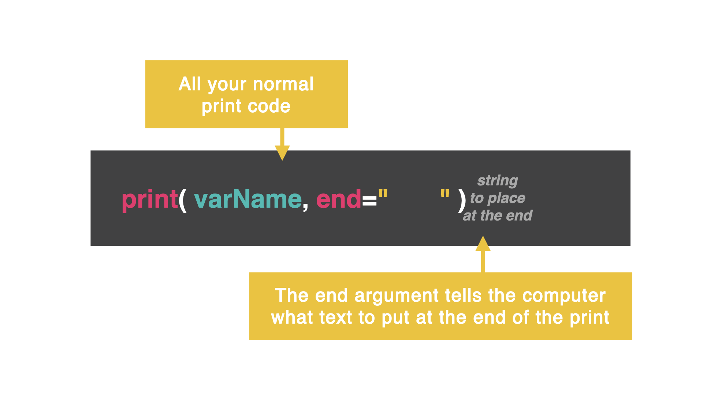

# Secret One: end


You can already create `print` statements like a boss, but there are a few things you can do to make them easier.

Let's add a few secret **second** arguments to the `print` statement and see what happens.

## 

By default, at the end of every `print` statement, the computer clicks 'enter'. 

👉 Remember, how a range of numbers shows each number on a *new* line...

```python
for i in range(0, 100):
  print(i)
```




## Add a space
👉 Let's tweak that code and see if we can get it to print with a space between each number instead of a new *line*. What do you notice?

```python
for i in range(0, 100):
  print(i, end=" ")
```

## Add a space *and* comma
👉 What if we want to add a comma *and* a space? Let's try it by adding `,` to our argument. 

```python
for i in range(0, 100):
  print(i, end=", ")
```
Now this looks like a proper list!

## Add a new line, tab, or vertical tab

👉 What happens if you add these different options in your second argument? Play around with these options below and see what they do:

```python
#new line
for i in range(0, 100):
  print(i, end="\n")
```
```python
#tab indent
for i in range(0, 100):
  print(i, end="\t")
```
```python
#vertical tab
for i in range(0, 100):
  print(i, end="\v")
```


### Play around with `end`. What can it do?

