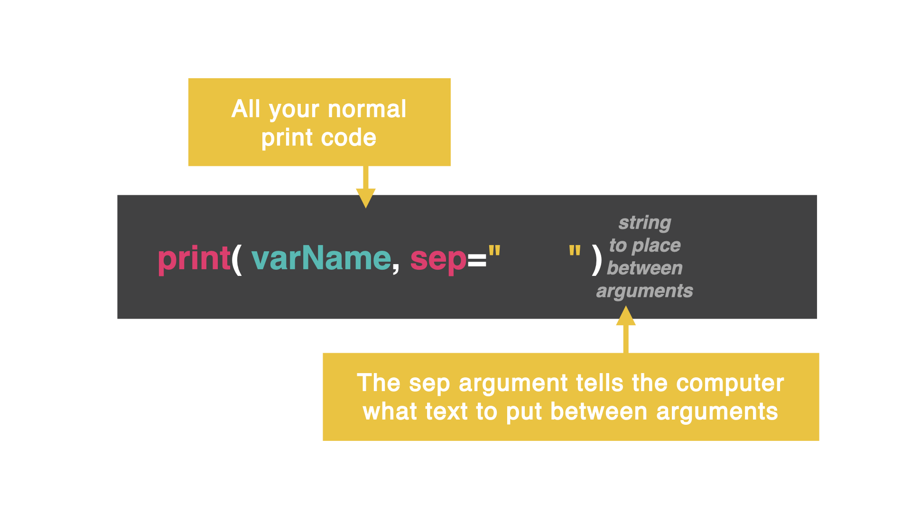

# Secret Two: sep

(Wait...why are we still using `end` when this chapter is about secret two, `sep`? Just hold tight...)

## Color Changing with end...


👉 I can turn the colors on and off different bits of the code by using `end`. Remove the previous code from your `main.py` file and try this out. 
```python
print("If you put")
print("\033[33m", end="") #yellow
print("nothing as the")
print("\033[35m", end="") #purple
print("end character")
print("\033[32m", end="") #green
print("then you don't")
print("\033[0m", end="") #default
print("get odd gaps")
```

👉 Let's concatenate that same `print` statement:

```python
print("If you put", "\033[33m", "nothing as the", "\033[35m", "end character", "\033[32m", "then you don't", "\033[0m", "get odd gaps", end="")
```

Now you may notice that we are getting weird double spaces in between the different sections. Let's fix that! 

## Color changing with sep...

👉 Take this same code and change `end` to `sep` (short for separator) and add a space at the end of each string. What happens?

```python
print("If you put ", "\033[33m", "nothing as the ", "\033[35m", "end character ", "\033[32m", "then you don't ", "\033[0m", "get odd gaps ", sep="")
```



### This is a much easier way to control spacing in random text or emojis too!