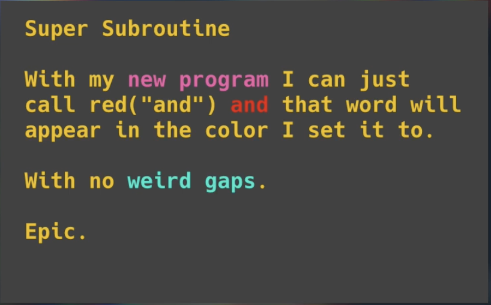

# 👉 Day 29 Challenge

- Write a subroutine that writes text in color. All it will do is print out the text in that color and turn the color back to normal when it's finished. 

- Control `end` and `sep` so there are not random symbols or spaces.

- Check out [this github resource](https://gist.github.com/rene-d/9e584a7dd2935d0f461904b9f2950007) for the color codes.

Example:




<details> <summary> 💡 Hints </summary>

- Create a subroutine with a variable for 'word' and 'color' through the use of `if` statements. Here is an example of how to include the color red:

```python
 if color=="red":
    print("\033[31m", word, sep="", end="")
```

- `print` your title 'Super Subroutine' and 'with my' as regular `print` statements.
- `print` the rest of the text in different colors by calling the subroutine.


</details>